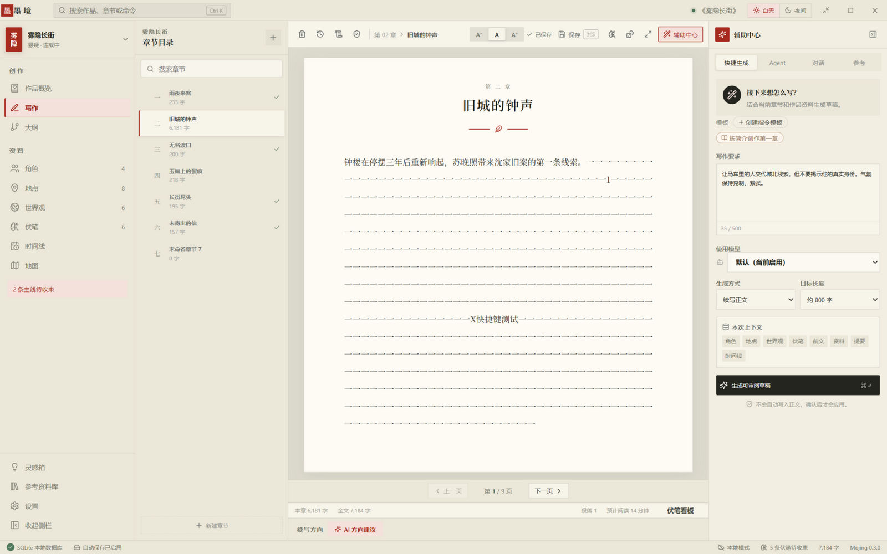
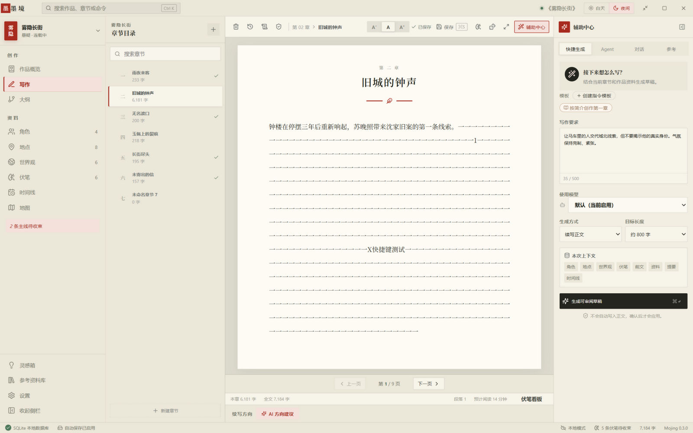

# 墨境（Mojing）

写给长篇作者的创作工作台。一本书从大纲、正文到人物、伏笔、时间线，装进同一个安静的界面；AI 在手边，笔在你手里。

所有创作数据存在你自己的电脑上（单文件 SQLite），不注册、不联网也能完整使用。

<p>


</p>

> 写作页的白天 / 夜间主题：左侧章节目录，中间稿纸式编辑器，右侧 AI 面板。

## 功能一览

### 写作

- **稿纸式编辑器**：宋体正文、居中排版、自动分页，字号三档可调
- **章节版本历史**：每次保存留档，可回滚任意历史版本
- **自动保存**：停稿数秒即落盘，切换章节与关窗时强制补存
- **专注模式**（`F4`）：隐藏一切界面元素，只剩满屏正文与字数进度
- **灵感收集箱**（`F5`）：随时记下转瞬即逝的点子，事后归档到作品
- **命令面板**（`Ctrl+K`）：搜索作品、章节与全部功能
- **大纲页**：章节卡片拖拽排序 + 全书结构脑图

### AI 辅助

自带模型接口配置，多套写作模型可切换，按模型统计 token 用量。

- **续写**：先给「续写方向」（剧情走向），AI 按方向写，不跑偏
- **润色 / 改写**：逐句给出审阅式差异（红删绿增），逐条采纳或保留
- **对话推演**：与角色或「编辑部」对话，为剧情找出路
- **起名工具**：角色、地点、功法、章节名批量起名
- **文风画像**：从既有正文提炼文风，让续写贴近你的笔感
- **发布自检**：敏感词与文风检查，发布前最后一道闸
- **作品简介生成**：输入构想，生成简介草稿

### 世界观资料

- **角色 / 地点 / 世界观词条**：角色关系图、登场记录与空窗提醒
- **伏笔看板**：埋设 → 暗示 → 展开 → 收束，状态流转与主线到期提醒
- **时间线**：全书大事记
- **可视化地图**：手绘标注、地形涂鸦
- **资料库（RAG）**：导入参考资料，写作时语义检索相关片段；仅向量计算调用 API，正文与索引不出本机

### 数据

- 单文件 SQLite（默认 `墨境数据/mojing.db`），设置页可自定义存放位置，迁移时自动携带现有数据
- 自动滚动备份（每次启动 + 每日首写，保留最近 10 份）+ 手动备份
- 导出与 WebDAV 远端备份

## 界面设计

水墨新中式「朱批」视觉体系：宣纸与墨色的昼夜双主题、直角与发丝线、宋体标题与汉字章节序号；朱砂只作印章式点缀——书脊、当前章节、焦点与主操作。设计探索稿见 `designs/`。

## 快捷键

| 按键 | 功能 |
|---|---|
| `Ctrl+K` | 命令面板 |
| `F4` | 专注模式 |
| `F5` | 灵感收集箱 |

## 从源码运行

环境：Node 20+，Python 3.12/3.13（3.14 过新，部分依赖未适配）。

```bash
npm install                              # 前端依赖
pip install -r backend/requirements.txt  # 后端依赖
npm run dev          # 开发模式（前后端，浏览器访问 http://127.0.0.1:5175）
npm run desktop      # Electron 桌面开发模式
npm run typecheck && npm run lint        # 类型检查 / ESLint
npm run test         # 后端 pytest（鉴权、密钥加密、版本节流、备份、数据目录迁移）
```

## 构建与发布

```bash
npm run pack    # 本地打包（win-unpacked 免安装目录）
npm run dist    # 构建安装包并发布 GitHub Releases（需 GH_TOKEN），electron-updater 据此自动更新
```

国内网络下 electron 二进制下载建议走镜像：

```bash
ELECTRON_MIRROR=https://npmmirror.com/mirrors/electron/ \
ELECTRON_BUILDER_BINARIES_MIRROR=https://npmmirror.com/mirrors/electron-builder-binaries/ \
npm run pack
```

- 前端 Vite 构建；后端经 PyInstaller 打为单文件 `mojing-backend.exe` 随包分发
- **代码签名**：未购 OV 证书前，Windows 首次运行会提示「未知发布者」，属预期；长期建议签名

## 安全说明

本地 API（`127.0.0.1:8765`）使用 bearer token 鉴权，token 在后端启动时生成并持久化，Electron 主进程通过 `/api/health` 获取并经 preload 注入渲染进程。已知权衡：`/api/health` 是开放端点且返回 token，在单用户本机场景下「能跑本机进程」等价于「能直接读 SQLite 文件」，不构成新增攻击面；浏览器跨域读取已被 CORS 拦截。AI 密钥在落盘前加密。

## 项目结构

```
electron/   Electron 主进程与开发脚手架
backend/    FastAPI 后端（SQLite、AI 代理、备份、RAG）
src/        React 前端（pages / components / hooks / lib）
designs/    UI 方向探索稿（水墨三稿对比页）
docs/       设计文档与历史优化记录
```

## 文档索引

- [RAG 设计](docs/rag-design.md)
- [UI 设计规范 v1](docs/ui-design-spec-v1.md)
- [优化建议（最新）](docs/optimization-suggestions-v3.md)
- [功能扩展规划](docs/feature-expansion-plan-v1.md)
